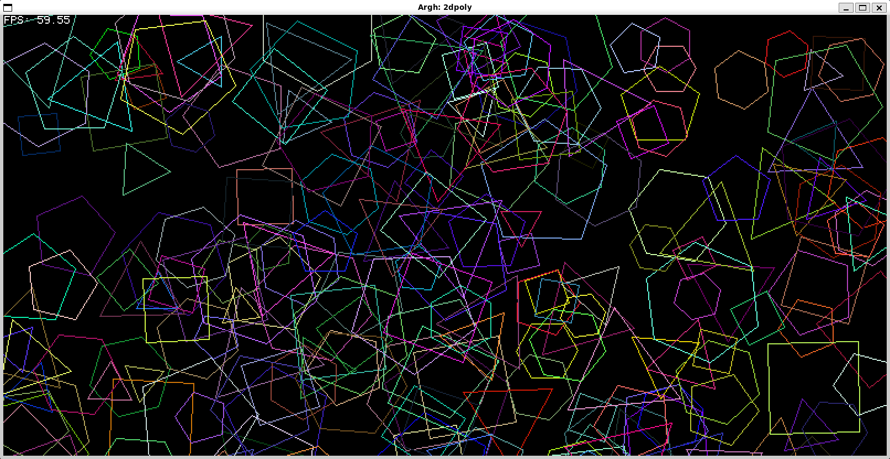

# ARGH: Another Rust Graphics Helper

[](https://github.com/benc-uk/argh/actions/workflows/ci.yml)
[](https://github.com/benc-uk/argh/actions/workflows/docs.yml)
[](https://github.com/benc-uk/argh/blob/main/LICENSE)
[](https://www.rust-lang.org/)
[](https://github.com/benc-uk/argh/commits/main)

ARGH is a learning project to build a software renderer in Rust. It is not intended to be a full-featured game engine, but rather a simple framework for experimenting with graphics programming concepts.

**It is purposely being developed without the use of AI coding assistants, code is written by hand in the traditional way**

Features:

- Window and framebuffer creation handled for you, backed by [minifb](https://docs.rs/minifb/latest/minifb/)
- Entirely software (CPU) based rendering loop and buffer operations
- Maths libraries for vectors and matrices
- Simple scene management
- Methods for drawing 2d primitives, pixels, lines and polygons
- 3D coming soon!

## Examples



## Usage

To use ARGH, add it as a dependency in your `Cargo.toml`:

```toml
[dependencies]
argh = "0.0.1"
```

Then, you can create a simple application by implementing the `Scene` trait and starting the engine:

```rust
use argh::core::{Engine, Scene};

struct MyScene {}
impl Scene for MyScene {
    fn update(&mut self, e: &mut Engine, _: f64) {
        // Update & draw here
    }
}

fn main() {
    let eng = Engine::new(800, 600, String::from("Hello World"));
    eng.start(MyScene {});
}
```

## Reference

- [Library API reference docs here](https://code.benco.io/argh/argh/index.html)

## Building and Running Locally

- Have Rust & Cargo installed
- Don't be on Windows (generally good advice)
- Run `make`

```
  🎮 Argh Engine

  build-win       🔨 Build all crates for Windows x64
  build           🔨 Build all crates
  check           ✅ Type check all crates
  clean           🗑️  Clean build artefacts
  clippy          📎 Run clippy lints
  doc-open        📖 Generate and open documentation
  doc             📚 Generate documentation
  fmt-check       🔍 Check formatting (CI)
  fmt             🎨 Format all code
  help            💡 Show this help message
  lint            🧹 Run all lints (fmt + clippy)
  run             🚀 Run an example (MODULE=basic1)
  test            🧪 Run all tests
```

## License

This project is licensed under the MIT License. See the [LICENSE](LICENSE) file for details.
