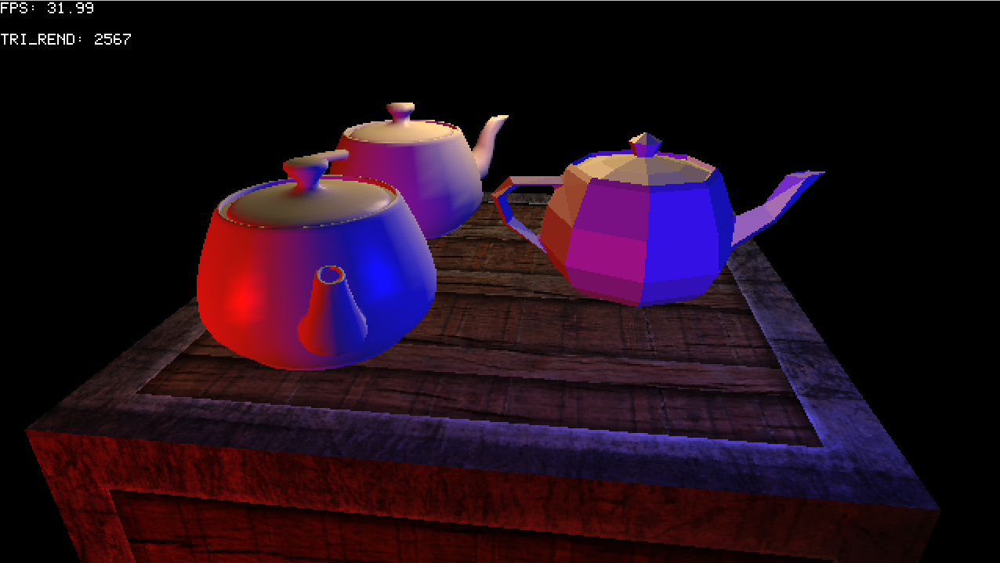
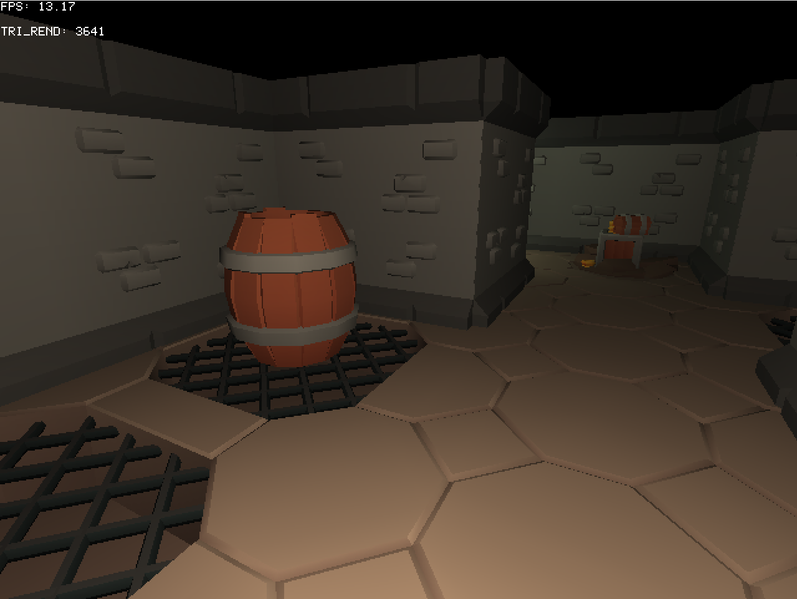
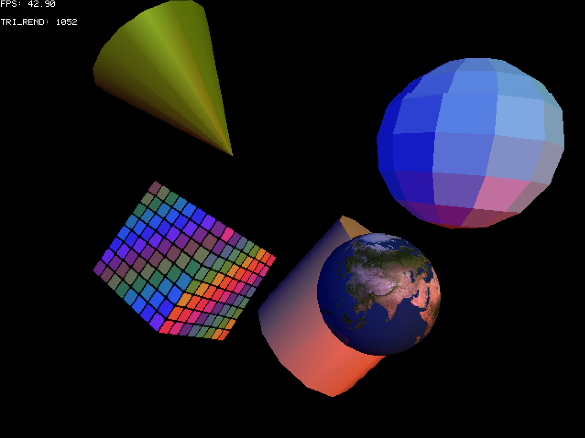

# ARGH: Another Rust Graphics Helper

[](https://github.com/benc-uk/argh/actions/workflows/ci.yml)
[](https://github.com/benc-uk/argh/actions/workflows/pages.yml)
[](https://github.com/benc-uk/argh/blob/main/LICENSE)
[](https://www.rust-lang.org/)
[](https://github.com/benc-uk/argh/commits/main)

ARGH is a learning project to build a software renderer in Rust. It is not intended to be a full-featured game engine, but rather a simple framework for experimenting with graphics programming concepts.

**It is purposely being developed without the use of AI coding assistants, code is written by hand in the traditional way**

Features:

- Window and framebuffer backed by [minifb](https://docs.rs/minifb/latest/minifb/)
- Entirely software (CPU) based rendering loop and buffer operations
- Core maths libraries for vectors, matrices and quaternions, implemented from scratch
- Scene & instance management
- 3D rendering
  - Rendering pipeline for meshes, with z-buffering and basic clipping (no Sutherland-Hodgman polygon clipping yet)
  - Diffuse illumination and Gouraud shading + texture mapping
  - Meshes, materials and textures
    - Textures can be image based texture maps or simple solid colours
  - OBJ loading & parsing with MTL support
  - Matrix operations for affine transforms
  - Cameras with perspective projection
  - Generators for cubes, spheres and teapots (what graphics system would be complete without the classic Newell Teapot!)
- Methods for drawing 2D primitives, pixels, lines and text

## What Does It Look Like?





<video src="https://github.com/user-attachments/assets/d7a717f7-1ad2-4392-9c1d-51f683e005f0" controls></video>

### Examples

See the [`examples`](./examples) directory for runnable demos (`basic1`, `hello_world`, `poly_2d`, `rects`, `simple_3d`).

## Usage

ARGH is not currently published to crates.io. Add it as a git dependency in your `Cargo.toml`:

```toml
[dependencies]
argh = { git = "https://github.com/benc-uk/argh" }
```

Then create a simple application by implementing the `App` trait and `update()` method, and creating & starting the engine (with an instance of your app):

```rust
use argh::prelude::*;

struct MyApp {}

impl App for MyApp {
  fn update(&mut self, e: &mut Engine, dt: f64, t: f64) {
    e.clear(BLUE);
    // Draw the rest of your frame here
  }
}

fn main() {
  let mut eng = Engine::new(800, 600);
  let mut app = MyApp {};
  eng.start_window(&mut app, "Hello World", 1);
}
```

# Taxonomy

See [architecture](./architecture.md) for more details

| Concept       | Purpose                                                                                                                                                                    | Composition / Relationships                                                                      |
| ------------- | -------------------------------------------------------------------------------------------------------------------------------------------------------------------------- | ------------------------------------------------------------------------------------------------ |
| **Scene**     | Top-level container of everything the renderer draws in a frame. Holds instances, lights and an ambient colour.                                                            | Owns a `SlotMap` of `Instance`s and a `SlotMap` of `Light`s (accessed via handles).              |
| **Instance**  | A placed occurrence of a `Model` in world space, with its own position, rotation, scale and shading flag. Lets one `Model` appear many times without duplicating geometry. | Stores a `ModelHandle` referencing a `Model` registered with the engine; lives inside a `Scene`. |
| **BakedMesh** | Similar to an `Instance` but can not be moved, and has lighting & transform baked in, designed for world geometry, lives inside a `Scene`.                                 | A copy of `Model` geometry (verts, uvs, etc) created with `add_static(ModelHandle)`              |
| **Model**     | A named, renderable 3D object that groups one or more meshes together. Used as the unit you load, register with the engine, and instance from.                             | Contains a `Vec<Mesh>`; referenced by `Instance` & `StaticMesh` via `ModelHandle`.               |
| **Mesh**      | The actual triangle geometry: vertices, normals, UVs and indices. Each mesh carries exactly one material so different parts of a model can be shaded differently.          | Owns a `Material`; lives inside a `Model`.                                                       |
| **Material**  | Surface description used during shading: diffuse colour, specular colour and hardness, plus an optional texture. Determines how a mesh reacts to light.                    | Optionally owns a `Texture`; embedded in a `Mesh`.                                               |
| **Texture**   | Raw image pixel data (packed 0RGB) with width, height and an alpha-cutout flag. Sampled in UV space to colour fragments during rasterisation.                              | Owned by a `Material`; sampled using a mesh's UVs.                                               |
| **Light**     | Point light defined by position, brightness, colour and attenuation factors. Contributes to per-pixel/per-vertex lighting calculations across all instances.               | Stored in a `Scene` and addressed via `LightHandle`.                                             |
| **Camera**    | Holds the view and perspective matrices and provides position / look-at controls. Defines from where and how the scene is projected to the screen.                         | Independent of `Scene`; passed to the engine when rendering.                                     |

**Flow:** `Engine` registers `Model`s (which own `Mesh`es → `Material`s → `Texture`s) and hands back `ModelHandle`s. A `Scene` then holds `Instance`s (referencing those models) plus `Light`s, and a `Camera` defines the viewpoint used to render it.

## Reference

- [Library API reference docs here](https://code.benco.io/argh/argh/index.html)

## Technical Notes

Graphics & 3D conventions followed internally by this engine are mostly the same as OpenGL, except clip space:

- Screen space has [x: 0, y:0] as top-left corner of the viewport. So Y increases downward
- We use a right handed coordinate system
  - Camera will be looking down the negative Z-axis; -Z is further away, +Z closer (or behind)
- CCW for vertices in triangle meshes
- Clip space z range is [0, +w] (NDC z is [0, +1] after perspective divide), unlike OpenGL's [-w, +w] / [-1, +1]
- We use a **reversed Z** depth mapping: the near plane maps to NDC z = 1 and the far plane to NDC z = 0. The depth buffer is cleared to 0 and the test is "greater wins".
  - This pairs f32's high precision near zero with the far end of the frustum and avoids the precision collapse you get with conventional 0..1 depth at small near planes

## Building and Running Locally

- Have Rust & Cargo installed
- Don't be on Windows (generally good advice). minifb works best on Linux & macOS; for Windows builds use the `build-win` make target to cross-compile via the `x86_64-pc-windows-gnu` toolchain
- Run `make`

```
  🎮 Argh Engine

  build-win       🔨 Build all crates for Windows x64
  build           🔨 Build all crates
  check           ✅ Type check all crates
  clean           🗑️ Clean build artefacts
  clippy          📎 Run clippy lints
  doc-open        📖 Generate and open documentation
  doc             📚 Generate documentation
  fmt-check       🔍 Check formatting (CI)
  fmt             🎨 Format all code
  help            💡 Show this help message
  lint            🧹 Run all lints (fmt + clippy)
  release-win     🚀 Build all crates for Windows x64 (release)
  release         🚀 Build all crates (release)
  run-example     🚀 Run an example as a desktop app
  site            📚 Build the project site combining docs and WASM example(s)
  test            🧪 Run all tests
  wasm-build      🕸️  Build the web_wasm example with wasm-pack
  wasm-serve      🌐 Build and serve the web_wasm example on http://localhost:8000
```

## License

This project is licensed under the MIT License. See the [LICENSE](LICENSE) file for details.
